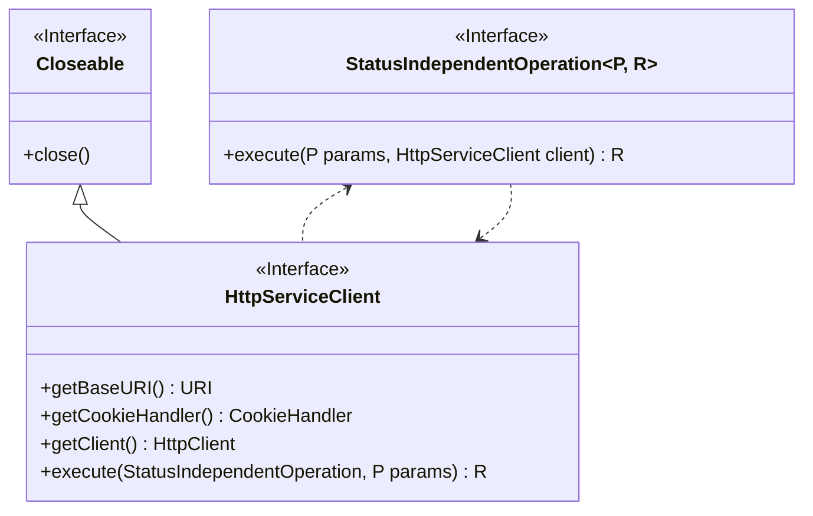
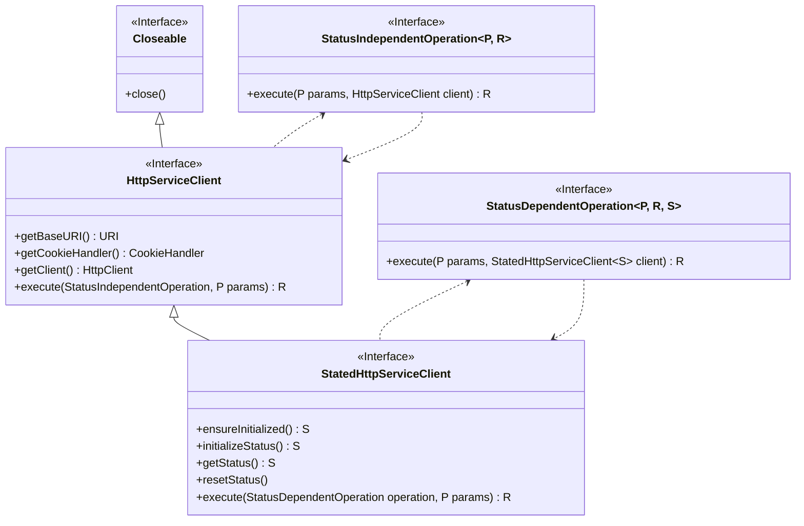
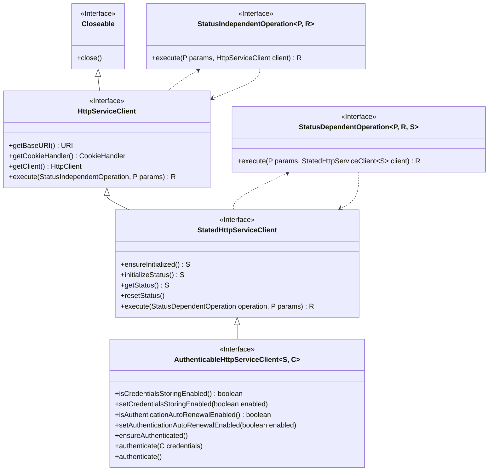
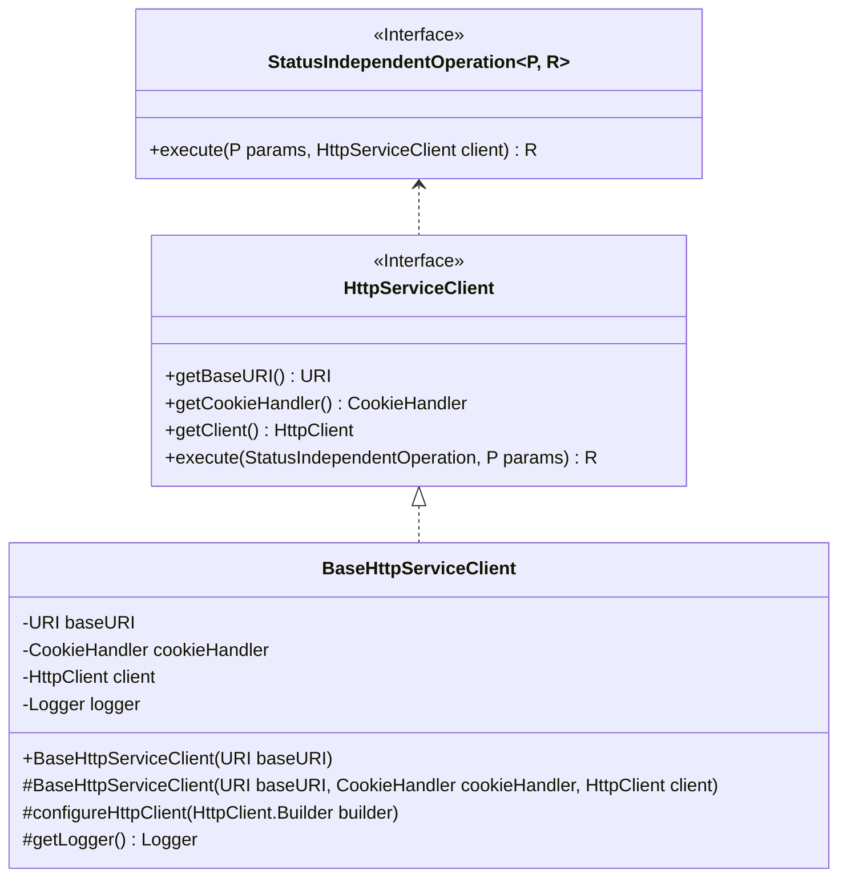
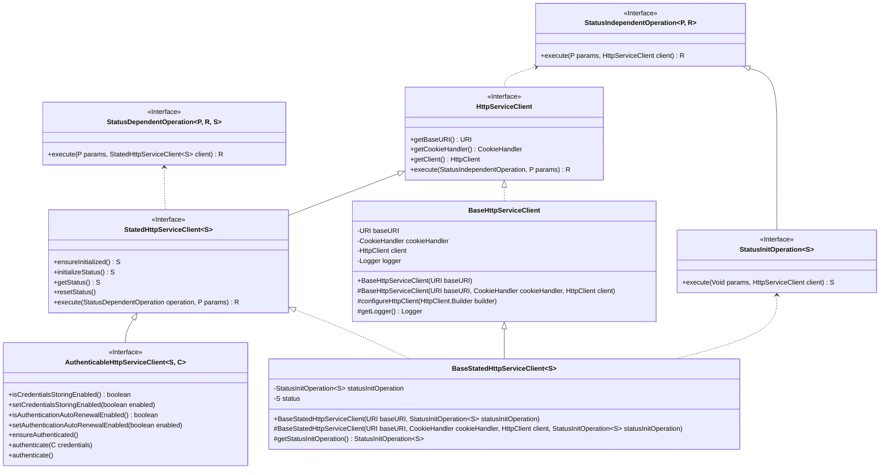
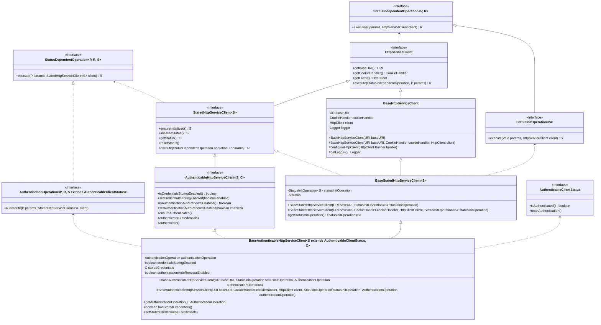

# HTTP Service clients

An HTTP service client is a client that performs a defined set of operations
over a HTTP service.

Two type of clients are defined: stateless clients (`HttpServiceClient`)
and stated clients (`StatedHttpServiceClient`).

## Stated HTTP service clients

Stated HTTP service clients keep track of a state between operation executions.

Note that stated clients can perform state independent operations.
One special type of state independent operation is the state initialization
operation, which returns the client's initial state. If this state
initialization depends on a service call or not is left to the operation
implementation

### Authenticable HTTP service clients

## Implementation

### Stated client implementation

### Authenticable client implementation

