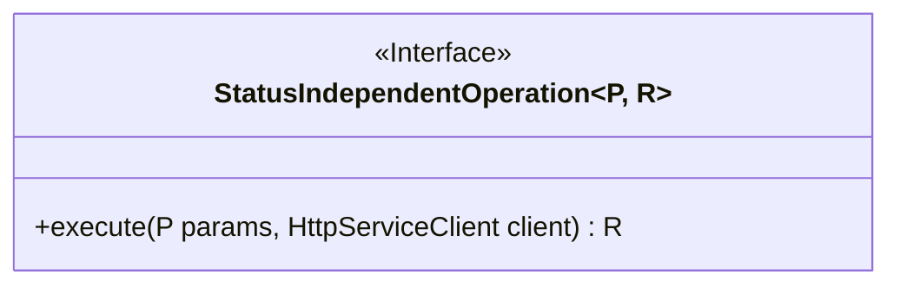
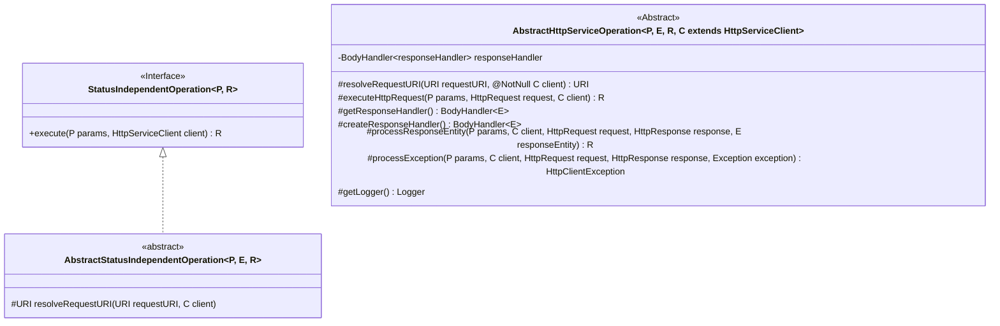
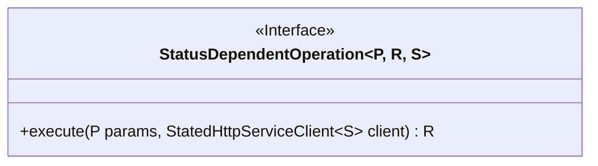
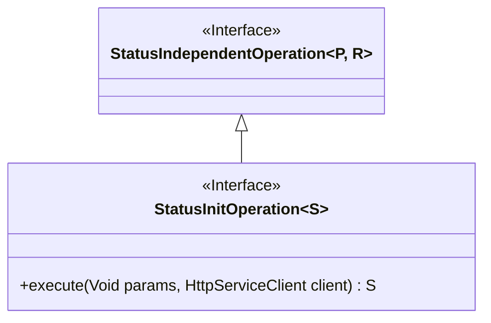
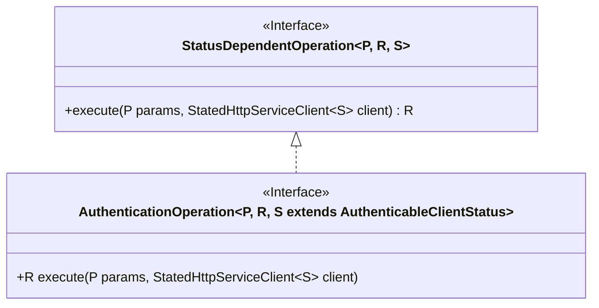
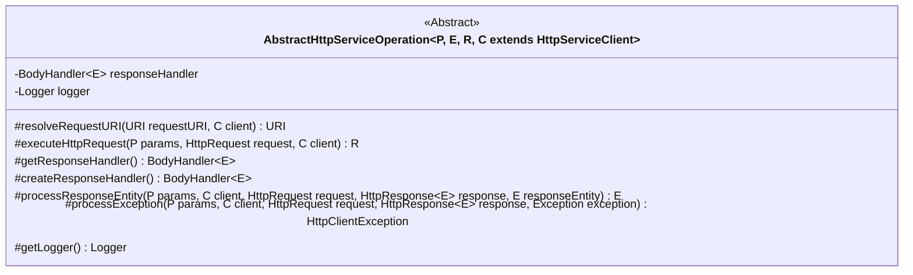
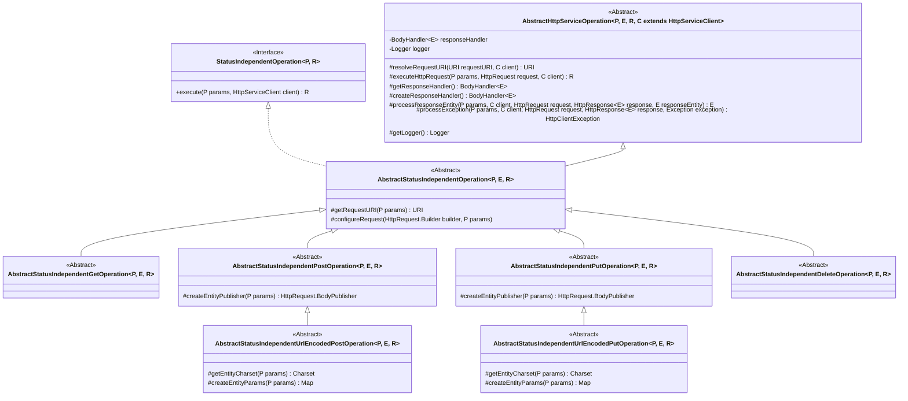
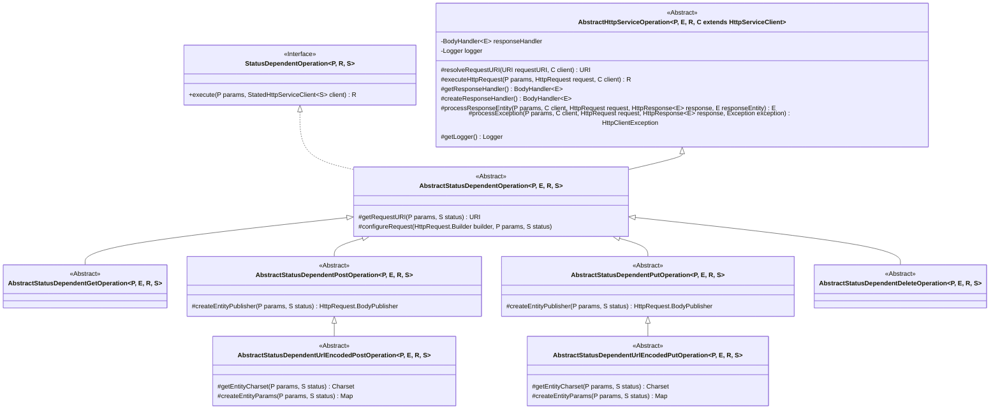

# Defining operations

Operations are abstractions of requests to the HTTP end point.

An operation consists on 3 or 4 components.

## Status independent operations

## Status dependent operations

### Status initialization operations

One special type of state independent operation are the state initialization
operations.

### Authentication operations

One special type of state dependent operation are the authentication operations.

## Implementing operations

### Base operation

### Implementing status independent operations

### Implementing status dependent operations

